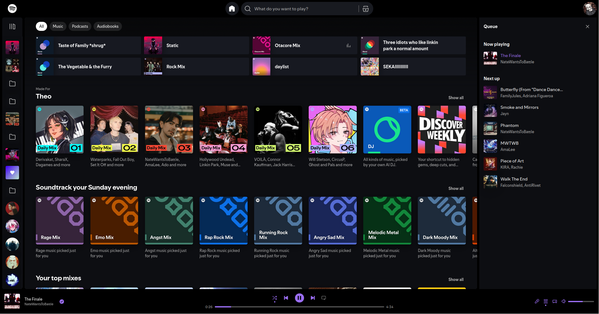

A repository of our custom stylesheets for various websites

We strongly recommend using these with the Userstyle manager [Stylus](https://github.com/openstyles/stylus), available for Firefox, Chrome, and Edge. We suggest this because we use Stylus' inline JavaScript implementation for some themes.

## INSTALL LINKS

Please use these links to install the styles, GitHub will not provide automatic updates!

[Discord NoAnnoyance](https://userstyles.world/style/14875/discord-noannoyance)\
[Unified Spotify](https://userstyles.world/style/8785/unified-spotify)\
[Dark Google Account](https://userstyles.world/style/15156/dark-google-accounts)

These themes are no longer maintained:\
[Simply Dark Drive](https://userstyles.world/style/15155/simply-dark-drive)

| THEMES |
| :----: |
|  |
|  |
