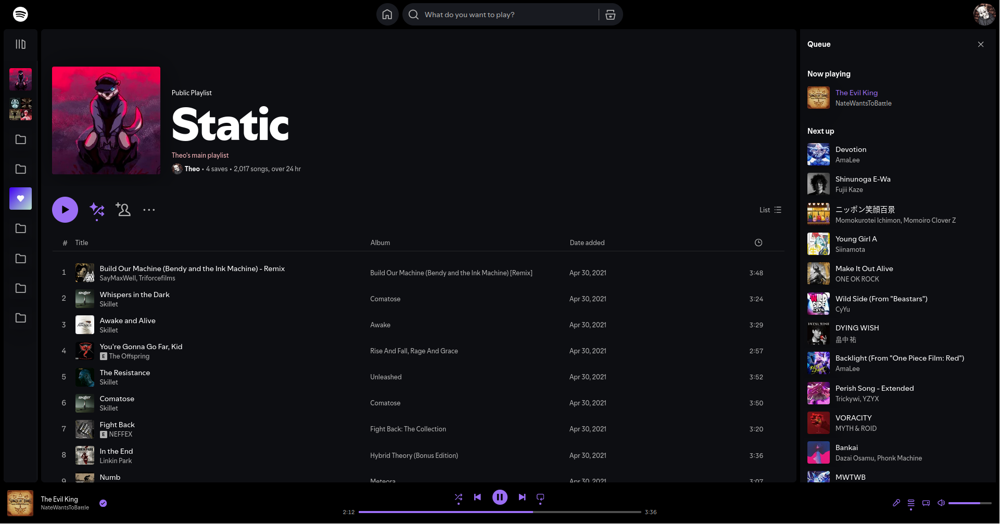
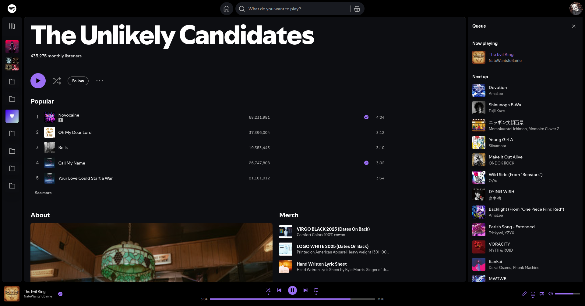
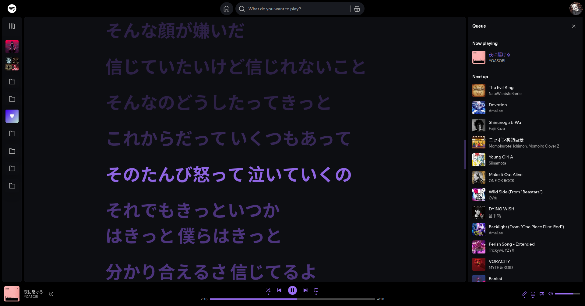
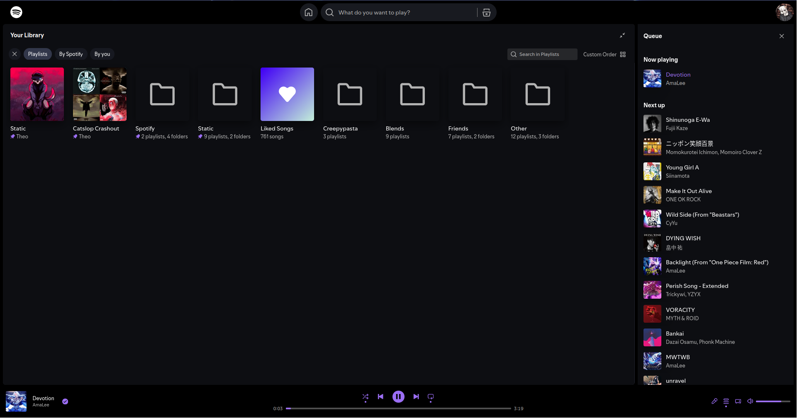
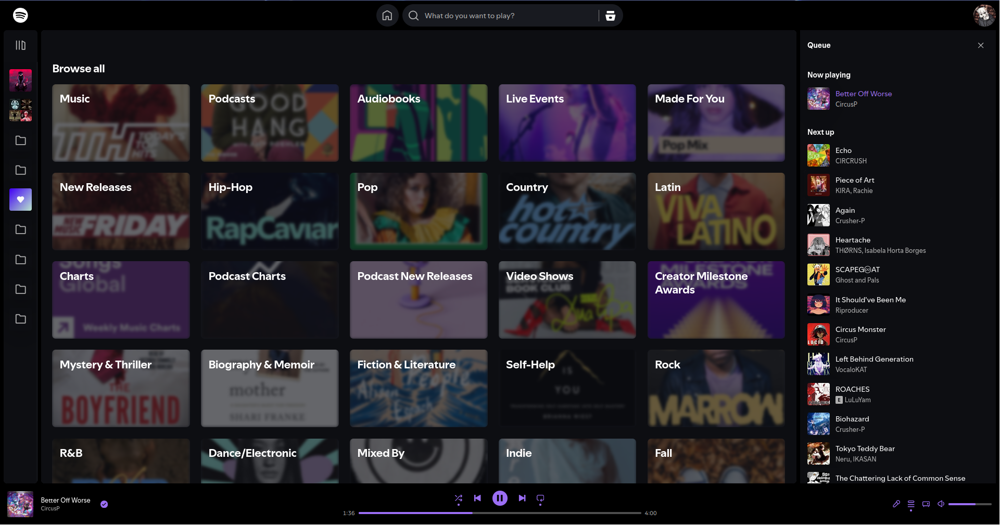
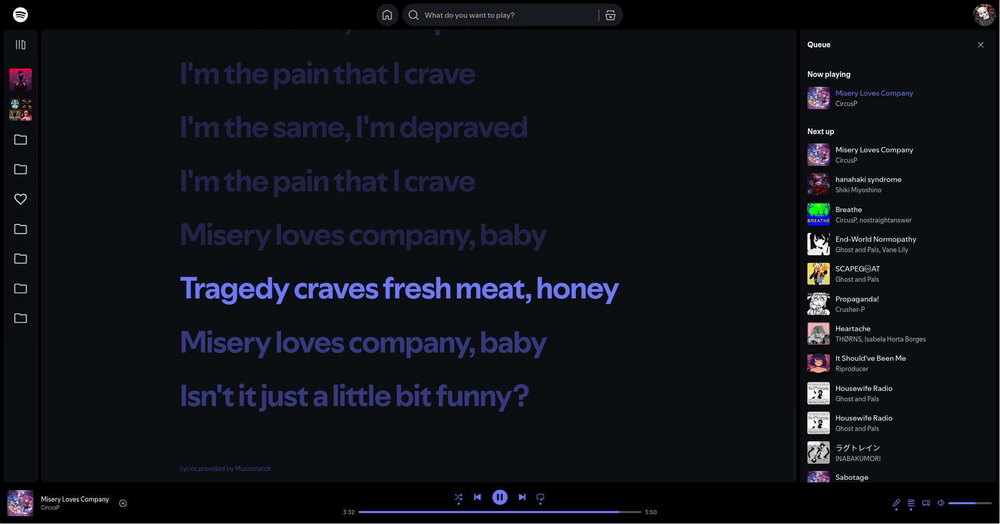
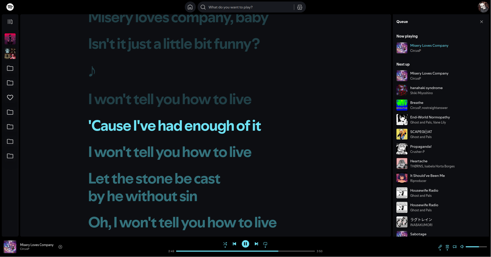
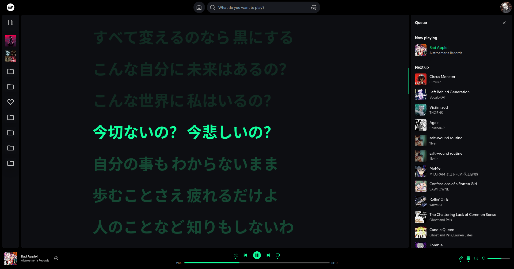
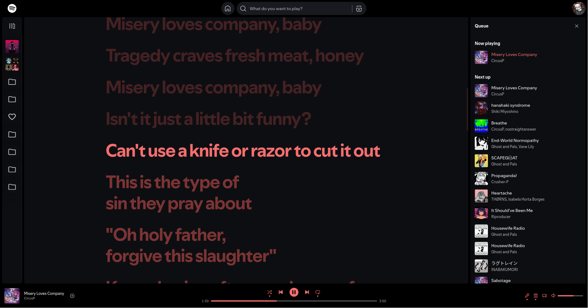
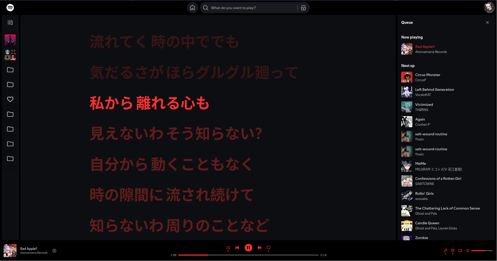

First thing's first: this theme will have a LOT of issues if your display language isn't English. I'm doing my best to improve this situation, but unfortunately I can't do much about it

## FAQ

### *I found an issue! What do I do?*

First, check if there are any updates available. If there are, install them!

If there are no updates, or the issue isn't fixed, you can either [open an issue](https://github.com/MurderAxolotl/stylesheets/issues/new/choose) or fix it yourself and open a pull request

### *How do I fix this issue I found?*

If you have experience with CSS and know how to use devtools, feel free to poke around Spotify's DOM and figure out how to fix the issue yourself. If possible, try NOT to use class names / IDs, these are randomized

## Style Options

| OPTION NAME | DESCRIPTION |
| :----:      | :----:      |
| I'M LAGGING             | Sacrifices visual quality for performance |
| HIDE RECOMMENDATIONS    | Hides the recommended tracks section under playlists |
| HIDE SPCONNECT BAR      | Hides the green `Playing On` bar under the UI |
| HIDE FOOTER             | Hides the footer at the bottom of the page |
| HIDE INSTALL NAGS       | Hides almost all `INSTALL APP` nags |
| HIDE HELP LINKS         | Hides the `SUPPORT` button in the profile menu |
| HIDE DJ CARD            | Attempts to remove DJ cards, where possible |
| IMMERSIVE COVER         | Experiment, makes the now playing cover 'pretty' |
| HOVERABLE GLOBAL HEADER | Hides the global header until you mouse it |
| HOVERABLE MINIM. SIDEBAR| Hides the MINIMIZED sidebar until you mouse it |
| SMOOTH SIDEBAR RESIZE   | Smoothly resizes the sidebar when you toggle it |
| MIN. FLOATING HEADER    | Reduce the floating header to just column info |
| HIDE NOTIF BELL         | Hides the bell near the profile menu |
| HIDE PLAYLIST PREVIEW   | Hides the glowing rectangle near play buttons |
| WS MODE                 | Removes buttons to declutter the UI. Leave disabled |
| SHOW USELESS THINGS     | Shows the `SETTINGS` button in the profile menu |
| GENRE CARD HOVER VFX    | Adds a fancy hover effect to genre cards |
| GRAYSCALE PLAYING GIF   | Makes the animated visualizer thing grayscale |
| USE MATERIAL SIDEBAR    | Replaces sidebar icons. See note #1 below |
| ENABLE EASTER EGGS      | Enable or disable easter eggs... lame :( |
| HOME ITEMS              | Removes various items from the home UI. See below |
| SCROLLBAR MODE          | Change the visual style of scrollbars. Limited support! |
| USE CUSTOM COLOURS      | Enables the use the custom accent colour |
| ACCENT COLOUR           | What colour to replace "Spotify Green" with |
| INACTIVE TOGGLE COLOUR  | What colour inactive toggles (Shuffle / Repeat) should be |
| ACTIVE TRACK COLOUR     | Depricated, pending removal |
| UI BACKGROUND           | Base colour of the UI |
| POPUP UI COLOUR         | Base colour of popup UIs ("modals") |
| CHIP COLOUR             | Colour of chip elements |

## HOME ITEMS
| PRESET NAME | ITEMS VISIBLE |
| :-: | :-: |
| EVERYTHING | Everything |
| MF/SOUNDTRACK/RECENT | Made For Soundtrack your day Recently played Your playlists |
| MF/RECENT/PLAYLISTS | Made For Recently played Your playlists |
| RECENT/PLAYLISTS | Recently played Your playlists |
| PLAYLISTS | Your playlists |
| MUSIC ONLY | Made For Soundtrack your day Recently played Jump back in Your top mixes Based on recent listening Recommended stations Your playlists New releases |
| MUSIC, NO RADIO | Made For Soundtrack your day Recently played Jump back in Your top mixes Based on recent listening Your playlists New releases |
| THEO'S PRESET | Made For Soundtrack your day Your top mixes Your playlists |

Please note, this feature only works if your display language is set to English! Leave it set to "Everything" if your display language is NOT English

## IMPORTANT NOTES

[1] - Option only applies when sidebar is in docked / "minimized" form (where you can only see icons)

## PREVIEW IMAGES

These previews use the default theme colour. For examples of different accent colours, see the next section

| LOCATION  | IMAGE |
| :-:       | :-:   |
| Playlists |  |
| Artists   |  |
| Lyrics    |  |
| Library   |  |
| Genres    | 

## PREVIEW IMAGES - COLOUR EXAMPLES
| HEX CODE | IMAGE |
| :-:      | :-:   |
| #6e79f4  |  |
| #6ee2f4  |  |
| #10ff9c  |  |
| #f46e6e  |  |
| #ff3030  |  |

Of course, any colour in the RGB gamut is supported, but these make for neat little demos :3
